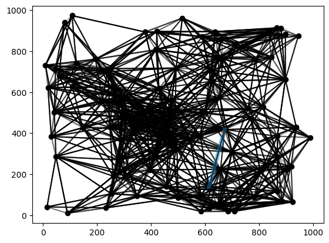

# Project Report - Network Routing

## Baseline

### Design Experience

Sam Bills and I did the design experience on 10/8/2025

For the linear PQ, I will implement it as a python list and simply iterate over that list when I put something in there that has priority to know where it needs to be put. To extract from the PQ, I will simply pop the element from the front (or back) of the list.

I will implemented the actual path finding by simply translating the pseudocode into python source. The correspondence between the two is pretty much 1 to 1.

### Theoretical Analysis - Dijkstra's With Linear PQ

#### Time

##### find_shortest_path_with_linear_pq - **O(V^2 + E)**

```py
def find_shortest_path_with_linear_pq(
        graph: dict[int, dict[int, float]],
        source: int,
        target: int
) -> tuple[list[int], float]:
    """
    Find the shortest (least-cost) path from `source` to `target` in `graph`
    using the array-based (linear lookup) algorithm.

    Return:
        - the list of nodes (including `source` and `target`)
        - the cost of the path
    """
    distances = {node: float('inf') for node in graph} # O(V)
    distances[source] = 0 #O(1)
    prev = {node: None for node in graph} #O(V)
    pq = LinearPQ() # O(1)
    run_dijkstras(graph, distances, prev, pq)
    total_cost = distances[target] #O(1)
    path = get_path(source, target, prev) # O(V)
    return path, total_cost
```

It's quite self explanatory why the initialization is simply O(V) because you simply initialize the distances and the previous dictionary by iterating through all the node. The same goes for the path, which will contain at max all n nodes.For that reason, these outer parts are O(V).

```py
def run_dijkstras(graph, distances, prev, pq: BasePQ):
    for node, distance in distances.items():
        pq.push(node, distance)                #O(V * push complexity)
    while not pq.is_empty():
        u = pq.pop()          #O(V * pop complexity)
        for v, cost in graph[u].items():   # O(1) hash map lookup
            if distances[v] > distances[u] + cost:  # O(1) basic arithmetic and hash table lookup
                distances[v] = distances[u] + cost  # O(1) basic arithmetic and hash table lookup
                prev[v] = u    # O(1) hash map lookup
                pq.update_priority(v, distances[v])  # ~ O(E * update complexity)
```

We push every node into the priority queue and we pop every node from the priority queue, which means that those place contribute V * their respective time complexity (push and pop) to the overall time complexity.

However, calling update priority doesn't necessarily happen to every node, as there could be orphaned nodes that aren't connected too. Furthermore, update_priority could be called on the same node twice if a better path is revealed. For that reason, the amount of calls to update priority varies more based on the number of edges than the number of nodes, so I recorded it as (O E * update complexity)

```py
    def push(self, item, priority):
        self.elements.append((item, priority)) # O(1)
        self.reference[item] = len(self.elements) - 1 #O(1)

    def is_empty(self) -> bool:
        return len(self.elements) == 0 #O(1)
```

Put quite simply here, pushing onto the linear PQ simply involves appending to the end of the array and record the index. This is a simple constant time operation for arrays.

The is_empty() simply checks if the list is empty. Again, this is self explanatory as a constant time operation.

So, pushing with our linear PQ O(1) constant.

```py
def pop(self):
        curr_min = self.elements[0][1] #O(1)
        curr_min_index = 0   #O(1)
        for i, element in enumerate(self.elements): #O(V)
            if element[1] < curr_min: #O(1)
                curr_min = element[1] #O(1)
                curr_min_index = i #O(1)
        item = self.elements.pop(curr_min_index)[0] #O(V)
        self._update_reference(item, curr_min_index) # See below
        return item
    
    def _update_reference(self, item, popped_index):
        del self.reference[item] #O(1) hash table lookup and memory freeing
        for i in range(popped_index, len(self.elements)): #O(V)
            self.reference[self.elements[i][0]] -= 1 #O(1)
```

Pop is riddle with a lot of obviously constant time operations like pointer array arithmetic and hash table lookups as seen above. However, we have iterate through the list of elements to find our minimum. Additionally, we perform a pop operation on the list, which could potentially involve shifting over at worst V items to the left for O(V).

Additionally, the _update_reference subroutine has to iterate through potentially all the elements of the list (depending on which index was popped), which could iterate through all V nodes!. So, pop gets a time complexity of O(V) linear.

```py
def update_priority(self, item, priority):
        index = self.reference[item]  #O(1)
        self.elements[index] = (item, priority) #(1)
```

The update priority is function is trivial. It is constant because a hash table lookup is constant. Going back to Dijkstra's now, we see that the pushing operations are O(V * 1) = O(V). The popping operations are O(2V * V) = O(V^2). The update operations total to be O(E * 1) = O(E). So total for Dijkstra's is O(V + V^2 + E) = O(V^2 + E).

Going back to our outer function where we add the linear times for computing the path and initialization, we get O(V^2 + E + 3V) = **O(V^2 + E)**.

#### Space

##### find_shortest_path_with_linear_pq - **O(V + E)**

```py
def find_shortest_path_with_linear_pq(
        graph: dict[int, dict[int, float]], # O(V + E)
        source: int,
        target: int
) -> tuple[list[int], float]:
    """
    Find the shortest (least-cost) path from `source` to `target` in `graph`
    using the array-based (linear lookup) algorithm.

    Return:
        - the list of nodes (including `source` and `target`)
        - the cost of the path
    """
    distances = {node: float('inf') for node in graph} # O(V)
    distances[source] = 0 #O(1)
    prev = {node: None for node in graph} #O(V)
    pq = LinearPQ() # O(1)
    run_dijkstras(graph, distances, prev, pq)
    total_cost = distances[target] #O(1)
    path = get_path(source, target, prev) # O(V)
    return path, total_cost
```

The dictionary that is the graph holds a copy of all the nodes and edges, so it must be O(V + E) space. The other temporary initializations such as the distances and previous dictionaries are simply O(V) space because they only vary with the number of nodes. Subtraction and pointer arithmetic are O(1) because they are small simply negligible values stored in registers or in memory temporarily.

```py
def run_dijkstras(graph, distances, prev, pq: BasePQ): # O(V + E)
    for node, distance in distances.items():
        pq.push(node, distance)         # O(V)
    while not pq.is_empty():
        u = pq.pop()       # O(V), same data structure
        for v, cost in graph[u].items(): 
            if distances[v] > distances[u] + cost: 
                distances[v] = distances[u] + cost 
                prev[v] = u # O(V)
                pq.update_priority(v, distances[v]) 
```

Is really the data structures that matter, for that reason the arithmetic operations performed here do not significantly impact space. The graph is here which add O(V + E) as explained before. The distances and previous maps store V nodes at max, so they both contribute O(V).

```py
class LinearPQ(BasePQ):
    def __init__(self):
        self.elements: list[tuple[str, str]] = []
        self.reference: dict[int, int] = {}
```

This is really the only relevant function for space complexity of the linear PQ. All the functions are simply performing operations on these two data structures: the list of elements and the dictionary that store an index to a particular element.

Because there are at most V nodes in the Linear PQ, both of these data structures hold at most V nodes worth of data and are therefore O(V) in space.

```py
    def push(self, item, priority):
        self.elements.append((item, priority)) 
        self.reference[item] = len(self.elements) - 1 

    def is_empty(self) -> bool:
        return len(self.elements) == 0 
```

Of course this is the method that add to the PQ, which will be at most V for O(V). Its own internal space complexity is negligible because its just arithmetic and temp values.

```py
def pop(self):
        curr_min = self.elements[0][1] 
        curr_min_index = 0   
        for i, element in enumerate(self.elements): 
            if element[1] < curr_min: 
                curr_min = element[1] 
                curr_min_index = i 
        item = self.elements.pop(curr_min_index)[0] 
        self._update_reference(item, curr_min_index)
        return item
    
    def _update_reference(self, item, popped_index):
        del self.reference[item] 
        for i in range(popped_index, len(self.elements)): 
            self.reference[self.elements[i][0]] -= 1 
```

Again, this method contributes nothing significant to space because its own internal space complexity is negligible because its just arithmetic and temp values.

```py
def update_priority(self, item, priority):
        index = self.reference[item]  #O(1)
        self.elements[index] = (item, priority) #(1)
```

Similarly, the internal space complexity of the update method is negligible because its just arithmetic and temp values.

In conclusion, we see that the data structure that grows to be the largest throughout this process remains the graph at O(V + E). All the other data structures used are simply O(V) because the python garbage collector frees the memory when we iterate over the edges in dijkstra's algorithm. The same happens when we iterate over the elements in the LinearPQ.

So, I predict the space complexity to be **O(V + E)**, with the graph itself being the driver of space.

### Empirical Data - Dijkstra's With Linear PQ

Ran with Density of 0.3

|    V    |    E    | Time (sec) |
| ------- | ------- | ---------- |
| 500     | 75000.0 | 0.018      |
| 500     | 75000.0 | 0.018      |
| 1000    | 300000.0 | 0.08       |
| 1500    | 675000.0 | 0.18       |
| 2000    | 1200000.0 | 0.331      |
| 2500    | 1875000.0 | 0.573      |
| 3000    | 2700000.0 | 1.24       |
| 3500    | 3675000.0 | 1.207      |

### Comparison of Theoretical and Empirical Results - Dijkstra's With Linear PQ

- Theoretical order of growth: **O(V^2 + E)**
- Theoretical Constant - 7.062448173827461e-08
- Empirical order of growth (if different from theoretical): **O(V^2 + E)** The Same
- Empirical Constant - 7.062448173827461e-08 The Same


As you can see, the constants make a near perfect flat plot here. This shows that my theoretical was probably correct.


Here is the plot of the empirical data plotted with the constant. As you can see, the theoretical line nearly perfectly follows the trend clearly seen by the points here. However, there are a few exceptions. You can see that near the end there are some outliers popping up. There are a few reasons why we could be getting that noise there. Regardless, the trend seems to be clear in favor of the theoretical of **O(V^2 + E)**. This was just as I predicted.

I think that the noise could be because I think that the python list is implemented similar to a c++ vector. It needs to grow by allocating more memory and moving everything over. I wonder if when you reach a certain point, it becomes enough to be significant. That could be the noise we see here.

## Core

### Design Experience

Sam Bills and I did the design experience on 10/8/2025

For the heap priority queue, I will also implement the binary heap using an array. But instead of iterating over every element when I insert, I will insert at the bottom of the heap and have it percolate it up. When I pop from the priority queue, I will initially put the element at the bottom of the heap on the top and have that element percolate its way down. My implementation for the actual dijkstra's will be the exact same except for the use of data structure. 

To update I'll have a dictionary point to each node in the array.

### Theoretical Analysis - Dijkstra's With Heap PQ

#### Time 

##### find_shortest_path_with_heap_pq - **O(V * Log V + E * Log V)**

My implementation of Dijkstra's with the HeapPQ is identical to the LinearPQ in literally every respect (I even used a super class for each PQ to inherit from) except for the fact that I simply use my HeapPQ class instead of the LinearPQ. For that reason, I will only go over the time complexity for the HeapPQ operations because the other stuff is the same and I already explained that.

```py
    def _swap(self, i, j):
        self.elements[i], self.elements[j] = self.elements[j], self.elements[i] # O(1)
        self.reference[self.elements[i][0]] = i # O(1)
        self.reference[self.elements[j][0]] = j # O(1)
```

As you can see, swapping two elements of the heap is simply a constant time operation because you simply swap the elements of an indexable list, which is a constant time operation.

```py
    def _percolate_up(self, index: int):
        index = index
        while index > 0: # O (Log V)
            parent = ((index + 1) // 2) - 1
            if self.elements[index][1] < self.elements[parent][1]:
                self._swap(index, parent)  # O(1)
                index = parent
            else:
                break
```

This subroutine performs swaps from the bottom (or the middle if its an update) to bring the element all the way to where it satisfies the min-heap property. Swapping is O(1), but the only question is how many times we perform it. In the worst case, we need the element to percolate all the way from the bottom of the heap to the top. That is, the height of the tree is the worst case. Because the height of a binary tree is given by Log base 2 of V, where V is the number of nodes, we conclude that upward percolation has a time complexity of O(Log n).

```py
    def _percolate_down(self):
        index = 0 # O(1)
        left_child = (2 * index) + 1 # O(1)
        right_child = (2 * index) + 2 # O(1)
        while left_child < len(self.elements): # O(Log V)
            smallest = self._get_smallest_child(left_child, right_child) # O(1) a trivial operation calculating the minimum. I won't show it because its simply min() with error checking in case the right child is out of bounds.
            if self.elements[index][1] > self.elements[smallest][1]: # O(1)
                self._swap(index, smallest) # O(1) explained before
                index = smallest
                left_child = (2 * index) + 1
                right_child = (2 * index) + 2
            else:
                break
```

Similar to percolating up, the percolate down subroutine calculates a few self explanatory constant time operations per swap (which is constant as explained before). The worst case is that the node at the top of the heap has to swap all the way down to the bottom, which would be the height of the tree swaps, making this complexity O(Log V).

```py
    def is_empty(self) -> bool:
        return len(self.elements) == 0 # O(1)

    def push(self, item, priority):
        self.elements.append((item, priority)) # O(1) appending to an array is constant
        last_index = len(self.elements) - 1 # O(1)
        self.reference[item] = last_index # O(1)
        self._percolate_up(last_index) # O(LogV)
```

Percolating up is the only non-trivial operation here, and it happens to be O(Log V), this make the push method O(Log v). Remember that deleting an element of a hash map is also constant because hash tables are constant time operations.

```py
    def pop(self):
        last_index = len(self.elements) - 1 # O(1)
        if last_index < 0: # O(1)
            raise ValueError("No Elements in the PQ")
        self._swap(0, last_index) # O(1)
        item, priority = self.elements.pop() # O(1)
        self._percolate_down() # O(Log V)
        del self.reference[item] # O(1)
        return item
```

Popping the item from the back of the list is a trivial constant time operation because you simply free up that memory. The only non-trivial operation here is percolating down, which is O(Log V), so the pop time complexity is O(Log V).

```py
    def update_priority(self, item, priority):
        index = self.reference[item] # O(1)
        self.elements[index] = (item, priority) # O(1)
        self._percolate_up(index) # O(Log V)
```

The reference index dictionary saves us a lot of time here because we can just do an O(1) lookup and access the index. Percolating up is O(Log V), so we get O(Log V) for update priority.

Taking that information, we can calculate the time complexity for Dijkstra's under the HeapPQ. We get O(E * Log V) for the calls to update. We get O(V * Log V) for both the calls to push and pop. remember that outside of running Dijkstra's, the time complexity for initialization and finding the path were only O(V). We collapse these together and get a final time complexity of **O(V * Log V + E * Log V)**.

#### Space

##### find_shortest_path_with_heap_pq - **O(V + E)**

Because these algorithms are the same except for the type of PQ, I will include the impact of the HeapPQ in this consideration to not repeat everything. Recall that outside of the LinearPQ, the largest data structure in space complexity was the graph at O(V + E). The for loop garbage collection still applies to this situation. Only the data structures are relevant here.

```py
class HeapPQ(BasePQ):
    def __init__(self):
        self.elements: list[tuple[int, float]] = [] # O(V)
        self.reference: dict[int, int] = {} # O(V)
```

As you can see, our HeapPQ uses two data structures: a reference dictionary of each node mapping to its index and a list of all Nodes and their priorities. Because at the beginning you have all V nodes in the PQ, The space complexity of our HeapPQ comes out to be O(V), which is the same as the LinearPQ.

Remember, the implementation is the same other than the HeapPQ. Therefore, because the HeapPQ is simply O(V) in space, the adjacency list dictionary for the graph still dominates in space complexity. This make the space complexity for the HeapPQ algorithm still **O(V + E)**

### Empirical Data - Dijkstra's With Heap PQ

Ran with Density of 0.3

|    V    |    E    | Time (sec) |
| ------- | ------- | ---------- |
| 500     | 75000.0 | 0.011      |
| 1000    | 300000.0 | 0.047      |
| 1500    | 675000.0 | 0.087      |
| 2000    | 1200000.0 | 0.153      |
| 2500    | 1875000.0 | 0.255      |
| 3000    | 2700000.0 | 0.399      |
| 3500    | 3675000.0 | 0.534      |


### Comparison of Theoretical and Empirical Results - Dijkstra's With Heap PQ

- Theoretical order of growth: **O(V * Log V + E * Log V)**
- Theoretical Constant: 1.3232889172313144e-08
- Empirical order of growth (if different from theoretical): 
- Empirical Constant: 1.3232889172313144e-08


As you can see, the constant distribution for the theoretical order is substantially flat. There's a single peak, but that's really just an outlier. The general trend here goes to show that the theoretical order is correct.


Here, you can see that the empirical closely mirrors the theoretical order. In fact, it looks like the theoretical perfectly traces it. This was just as I predicted in the theoretical analysis. Another thing worth noting is that there is a substantial amount of noise around the theoretical trend. Despite the noise, the noise seems to be evenly distributed around the theoretical line.

### Relative Performance Of Linear versus Heap PQ Performance

It is clear that the HeapPQ outperformed the LinearPQ by a lot from the empirical data. We see that the HeapPQ had an ultimate runtime of 0.534, and the LinearPQ had an ultimate runtime of 1.207. That's more than double the runtime!

This is likely because the iteration to pop from the LinearPQ is O(V). It has to iterate through literally every element to find the minimum. To the contrary, when we pop from the heap, we only have to traverse through Log base 2 of the elements of that list. That is substantially less!

It's clear that the linear cost of popping adds up as we scale the system up. Having an overall time complexity of O(V^2 + E) vs O(V * Log V + E * Log V) makes a really big difference. This is precisely why we're seeing that difference play out empirically here.

## Stretch 1

### Design Experience

Sam Bills and I did the design experience on 10/8/2025

To collect the data, I will simply use the command line input given to me. Then I will use matplotlib to plot the data. I will likely use the subplots feature.

I think that for both the more dense graphs and the less dense graphs, the heap will be faster for both because logarithmic time should always beat linear time regardless of how dense the graph is. I just don't think that the density will make a huge difference. Sure, the PQ does a lot of pointer arithmetic in percolation, but I still think that that will be faster than iterating over all elements of the list in every case.

### Empirical Data

| N    | Density | heap time (ms) | linear PQ time (ms) |
|------|---------|----------------|---------------------|
| 500  | .6      |      16        |      25             |
| 1000 | .6      |       63       |          103        |
| 1500 | .6      |      138       |          243        |
| 2000 | .6      |      259       |           452       |
| 2500 | .6      |      434       |          764        |
| 3000 | .6      |      668       |         1170        |
| 3500 | .6      |      931       |         1789        |


| N    | Density | heap time (ms) | linear PQ time (ms) |
|------|---------|----------------|---------------------|
| 500  | 1       |         25     |             31      |
| 1000 | 1       |         95     |          130        |
| 1500 | 1       |        225     |          315        |
| 2000 | 1       |        394     |          593        |
| 2500 | 1       |        659     |         1039        |
| 3000 | 1       |        1031    |         1703        |
| 3500 | 1       |        1672    |         2494        |

### Plot


### Discussion

As you can see, the HeapPQ implementation still outperforms the LinearPQ in runtime by a significant margin. This is exactly by expected result. I believe that being able to pop in O(Log V) time has made this great difference. It is important to not, however, that the relative runtime gap between the two implementations appears to shrink as density increases.

For example, in the first low density plot of 0.3, you can see that the linearPQ implementation ends with nearly double the runtime of the HeapPQ. That ending gap shrinks to slightly less than half in the medium density plot of 0.6. It then shrinks even more in the high density 1.0 plot to where there is just a 40 percent gap between the two.

The trend is clear that HeapPQ struggles more with increasing density, but from this data is doesn't appear to justify switching algorithms depending on density. This is because is all of these plots, its clear that HeapPQ gains on linear gains on LinearPQ as density increases. However, in all these cases, LinearPQ is still gaining on HeapPQ as input size increases.

It'd be interesting to see what would happen if you keep scaling up the density, which would mean that each node could have an edge to the same node twice. The practical applications of such a graph are likely sparse, but it'd be interesting to see if it's enough to make HeapPQ worse than LinearPQ.

## Stretch 2

### Design Experience

Sam Bills and I did the design experience on 10/8/2025

I think that the provided algorithm could be real in certain contexts where the weights actually are normally distributed. However, this implies a sense of randomness to the weights in actual business contexts that I don't think is always correct. If we talking about cities, I'm not sure that the distances from cities is necessarily going to be normally distributed because it just depends, but it still might be a useful heuristic for testing the algorithm.

Another way that you could generate a graph is by having each successive weight be greater than the first.

The kind of graph generation algorithm that I will develop will be based on the distances between cities. I'll get the average number of roads that go out of a particular cities and the average distance distribution to the closest city. I'll pull the edges and weights from a distribution that contains these factors (number of edges in a single node and for each edge pull a random weight from a given distribution from the real world).

I will implement this using the random.choices module from the standard library and importing my own list of the most likely weights for roads and number of roads going to or out of a single city.

### Provided Graph Generation Algorithm Explanation

The provided graph generation algorithm provides the **distribution="gaussian"** as a default parameter, so that gaussian distribution for randomness is the provided implementation for randomness. However, there are different distributions available that the provided algorithm does not use. The **seed parameter** allows you to supply a seed for the random number generation. You can use the same seed to make things deterministic.

The **density parameter** relates to the number of edges per node. Specifically, it is the percentage of nodes that a single nodes connects to. With a density of 1, each node has as many edges as there are nodes, which is based on the **size parameter**. Based on the edges per node, it then iterates through every node that it will create and it randomly chooses targets that that node will have edges to based on a uniform distribution sample. Each node has the same number of targets because the edges per node is the same for all of them.

To calculate the weights, it gets two points (x, y) for both the target and the source. These points (both the x and y values) are randomly selected from the normal distribution. It then calculates the distances between these randomly (through normal distribution) generated points.

The **noise** parameter is now used. The noise parameter is the standard deviation for another random number selected (with a mean of 0). The algorithm with then select the highest number among 0 and the distance + this_random_number. That number then becomes the weight for the edge. What this means is that with a high enough noise, you could end up getting 0 for a lot of different edges. The main thing here though is that the algorithm assumes that weights will be normally distributed and puts the normally distributed number through this set of transformations involving the noise around a random distribution to arrive at the final weight.

This algorithm works well in cases where every node has the same number of connections, and in cases where the weights between nodes is normally distribution and irrespective of the nodes at play. This does not make a lot of sense for modeling connections between cities because not every city has the same number of edges leading to or from it. Furthermore, the distances between cities are not normally distributed. In fact, I would argue that a city with less connection is likely to have a HIGHER weight on its edges. Take for example the city of Nephi, Utah.

This algorithm could work well for a network of city blocks where the distances between blocks can vary slightly and isn't a perfect grid system. In this situation, we would assume that each intersection is a node that connects to four other intersections. Some stretches of road between intersections could be longer or shorter, but they will generally be quite similar. I think its fair to say that the weights would be roughly normal in distribution.

### Selected Graph Generation Algorithm Explanation

My algorithm generates random points (equivalent to the size parameter) on a plane using a completely uniform distribution. Then, it connects those points (nodes) to all other nodes that are within a certain distance from it. However, when it calculates this distance between points, it accounts for the noise parameter which can randomly change the distance that it might have. The noise parameter simply adds a constant amount to the distance randomly chosen where the noise is the standard deviation of the a normal random distribution.

I implemented this using the uniform distribution module from random in the python standard library. I chose it because it better models how connection between cities would actually work. A city is more likely to be connected to a town that is closer to it. Also, some cities that are closer to more cities would have more connections. This way, not every node has the same number of edges. Nodes next to other nodes will likely have more edges.

There are also orphaned nodes that only have one connection because their so far away. This more accurately mirrors ghost-town cities that only connect to one other city by a highway. For the screen shots, I generated all the plots with the same seed so you could see how the path would differ based on the different edges.

#### Screenshots of Working Graph Generation Algorithm





## Project Review

I did the project review with Blake McGee on 10/10/2025. 

He had only completed the baseline tier so that's what he shared with me. We had very close to the same constant of proportionality for the LinearPQ. We also ended up with the same theoretical and empirical order.

His runtime graph looked slightly different than mine but it still seemed to follow the general trend pretty well. He had a different way of implementing the pop function that made it more compact. Instead of iterating through everything in the list to pop with an explicit for loop, he just used min() and passed in lambda function as the key that would access the priority part of the tuple of each entry.

His implementation of Dijkstra's was pretty much the same as mine. He popped all the entries from the priority queue as the function went. All in all, we had pretty similar results, but our design and code structure varied slightly.

